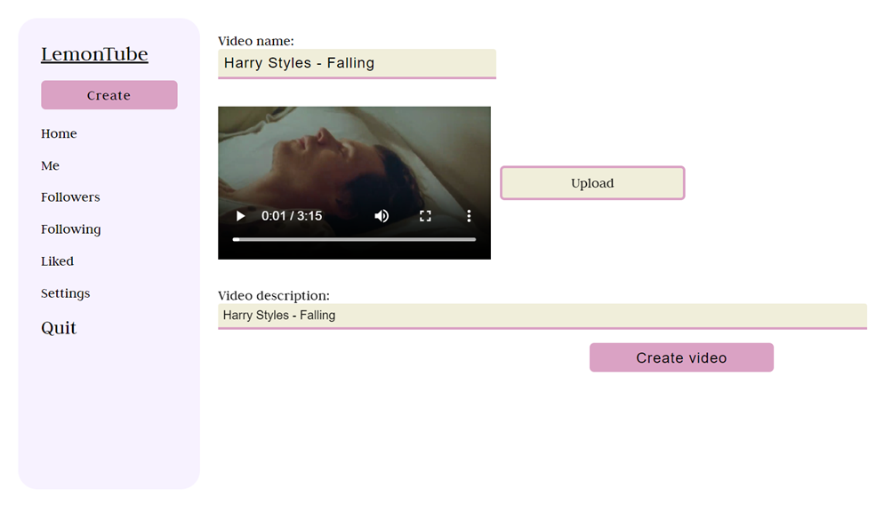
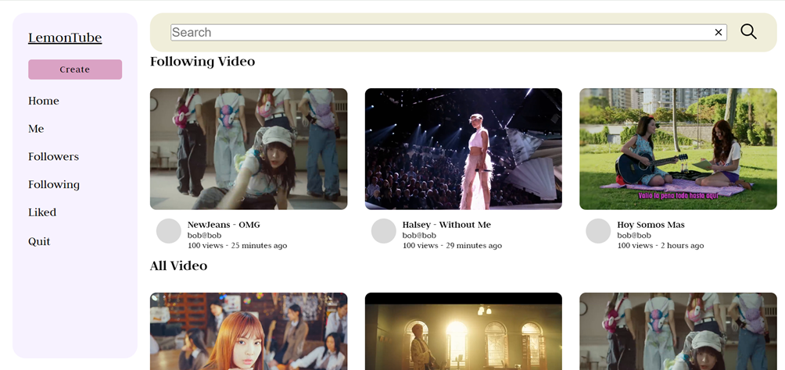
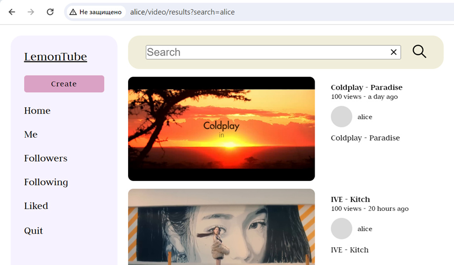
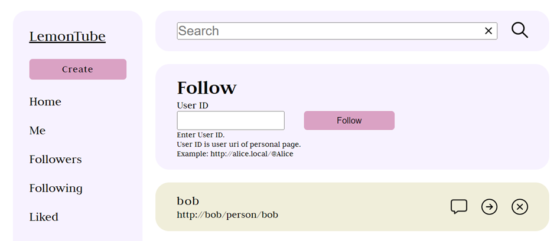
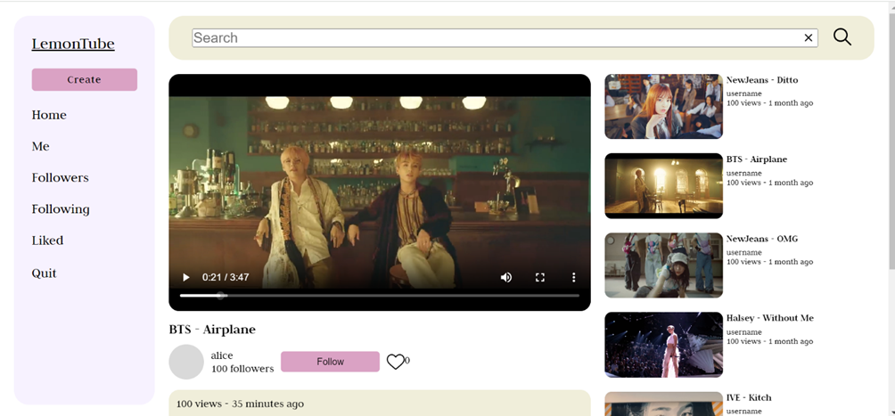

# LemonTube

## Описание

*Проект является частью дипломной работы

Цель данного проекта – создать децентрализованную социальную сеть (федеративную сеть), основанную на протоколе децентрализованных сетей ActivityPub. В качестве центрального веб-приложения данной сети необходимо реализовать видеохостинг, построенный на основе пиринговых сетей.

С использованием технологии NodeJS для серверной части приложения и протокола WebTorrent для эффективного обмена видеоконтентом, пользователи получат возможность просматривать видео, а также делится своими. А благодаря децентрализации и протоколу ActivityPub, пользователи различных приложений, которые могут и не являться частью пиринговой сети, смогут общаться посредством комментариев с пользователями видеохостинга.

## Используемые технологии

- NodeJs - серверная часть приложения + пользовательский интерфейс
- WebTorrent - для передачи видео
- ActivityPub - децентрализованный протокол для общения между серверами
- postgreSQL - база данных
- Redis - для хранения сессий
- Bittorrent tracker
- ffmpeg - для создания обложки видео

## Установка

1. Склонировать репозиторий

    ~~~
    git clone https://github.com/BystrovaV/LemonTube.git 
    ~~~

2. Установить библиотеки
    ~~~
    npm install
    ~~~

3. Установить ffmpeg
4. Установить nginx

## Запуск

Для работы приложения требуется:

- База данных - PostrgreSQL
- Redis - для хранения сессий
- Bittorrent tracker - его можно установить с помощью ```npm i -g bittorrent-tracker```

Можно воспользоваться предложенным docker-compose файлом или запустить самостоятельно. Запустить через docker-compose

~~~
docker-compose up --build
~~~

### .env файл

Для работы приложения необходимо прописать окружающие переменные. Пример файла прописан в ```.env.example```

### nginx

Для корректной работы (особенно если запускать несколько серверов) надо настроить nginx.

В hosts (Windows ```C:\Windows\System32\drivers\etc```, Ubuntu ```/etc/hosts```) разрешить будующие домены

~~~
127.0.0.1 alice
~~~

В настройках ```nginx.conf``` прописать настройки сервера
~~~
server {
    listen 80;
    index index.html index.htm;
    server_name alice;
    server_name_in_redirect off;
    client_max_body_size 100M;
    location / {
        proxy_pass http://127.0.0.1:3000;
        proxy_set_header X-Forwarded-Host $host;
    }
}
~~~

Указать в .env файле в переменной HOSTNAME название сервера
~~~
HOSTNAME=alice
~~~

### запуск

~~~
npm run dev
~~~

## Пример работы

1. Форма создания видео

    

2. Главная страница

    

3. Результаты поиска

    

4. Страница подписок

    

5. Страница воспроизведения видео

    